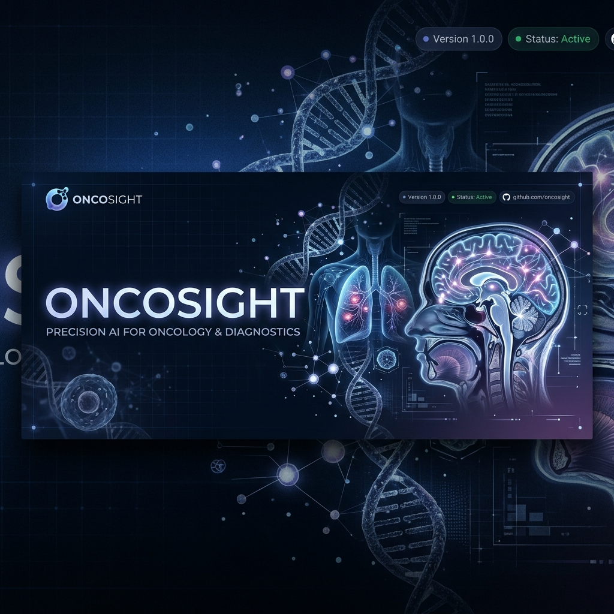
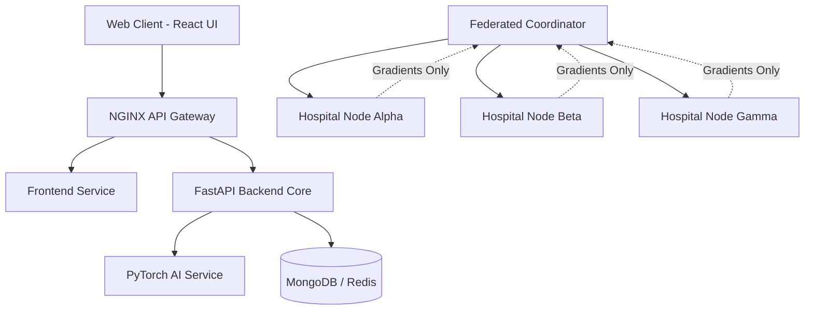

# 🧬 ONCOSIGHT AI Platform

> **An advanced, privacy-preserving AI platform for multi-modal cancer detection and federated medical learning.**



## 📌 Problem Statement
Medical imaging generates vast amounts of data, yet hospital networks struggle to share knowledge due to stringent privacy regulations (HIPAA/GDPR). This creates data silos that severely bottleneck AI advancements in oncology. **ONCOSIGHT AI** solves this by leveraging **Federated Learning**—allowing decentralized clinical institutions to collaboratively train highly accurate cancer detection models *without ever sharing raw patient data*.

## 🏗️ System Architecture
ONCOSIGHT operates on a distributed microservices architecture tailored for scalability, privacy, and real-time AI inference.



## 🚀 Key Features Implemented
- **🧠 Multi-Model Diagnostics:** Supports specialized detection for Lung Cancer, Pneumonia, Brain Tumors, and generalized lesion segmentation.
- **🛡️ Federated Learning Pipeline:** Three simulated hospital nodes (`Alpha`, `Beta`, `Gamma`) collaboratively train global models sharing only gradient updates.
- **🔍 Explainable AI (XAI):** Integrated Grad-CAM heatmap overlays on medical scans so doctors can visualize the model's exact region of focus.
- **🔐 Secure Role-Based Access:** Encrypted doctor and patient portals powered by JWT authentication.
- **📊 Real-time Monitoring & Dashboarding:** Live node health checks, federated accuracy metrics, and clinical scan reporting.
- **☁️ Cloud-Native Deployment:** Fully containerized with Docker, complete with Kubernetes (K8s) manifests (Deployments, Services, Ingress, HPA).

## 🛠️ Tech Stack
**Frontend**
- React 19 + TypeScript
- Vite
- Tailwind CSS & Framer Motion

**Backend & AI Services**
- Python 3.11 + FastAPI
- PyTorch & Torchvision
- OpenCV & NumPy
- Grad-CAM

**Database & DevOps**
- MongoDB (Atlas / Local)
- Redis
- Docker & Docker Compose
- Kubernetes (K8s)
- NGINX

## 💻 Getting Started (Local Development)

### Prerequisites
- Docker & Docker Compose
- Node.js (v18+)
- Python (v3.10+)

### Option 1: Full Docker Stack (Recommended)
Boot up the entire distributed system, including the NGINX gateway, backend, AI inference engine, database, and 3 federated hospital nodes.
```bash
docker-compose up --build
```
*Access the application at `http://localhost`.*

### Option 2: Manual Setup
**1. Start the Backend:**
```bash
cd backend
pip install -r requirements.txt
uvicorn app.main:app --reload --port 8000
```
**2. Start the Frontend:**
```bash
cd frontend
npm install
npm run dev
```

---
*Developed for the future of decentralized medical intelligence.*
