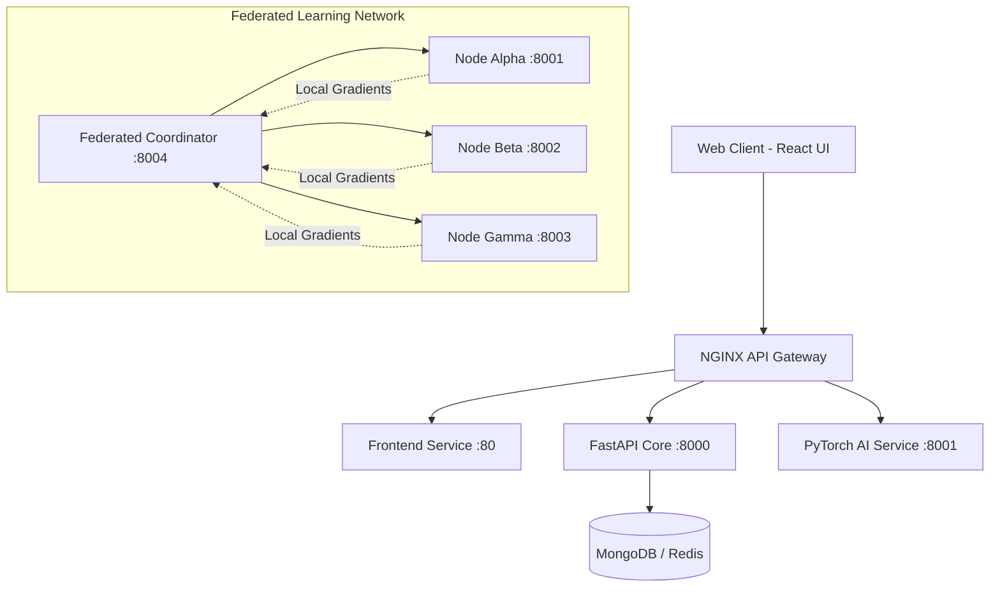

# 🧬 ONCOSIGHT AI Platform

> **An advanced, privacy-preserving AI platform for multi-modal cancer detection and federated medical learning.**


## 📌 Problem Statement
Medical imaging generates vast amounts of data, yet hospital networks struggle to share knowledge due to stringent privacy regulations (HIPAA/GDPR). This creates data silos that severely bottleneck AI advancements in oncology. 

**ONCOSIGHT AI** solves this by leveraging **Federated Learning**—allowing decentralized clinical institutions to collaboratively train highly accurate cancer detection models *without ever sharing raw patient data*.

---

## 🌟 What is ONCOSIGHT AI?
ONCOSIGHT AI is an end-to-end medical intelligence platform designed for oncologists and radiologists. It fuses state-of-the-art Deep Learning models with a decentralized training architecture. It provides an intuitive clinical dashboard where doctors can upload medical scans, receive instant diagnostic predictions with visual explainability, and track patient reporting—all while operating in a secure, microservices-driven ecosystem.

### 🚀 Core Capabilities
* **🧠 Multi-Model Diagnostics:** Supports specialized detection for Lung Opacity, Pneumonia, Brain Tumors, and localized lesion segmentation.
* **🛡️ Federated Learning Pipeline:** Simulates hospital nodes (`Alpha`, `Beta`, `Gamma`) that collaboratively train global models. Nodes compute gradients locally and share only weight updates with the central coordinator.
* **🔍 Explainable AI (Grad-CAM):** Generates live Grad-CAM (Gradient-weighted Class Activation Mapping) heatmaps overlaying medical scans, showing doctors *exactly* where the model is looking.
* **🔐 Secure Role-Based Access:** Encrypted doctor portals using secure JWT authentication.
* **📊 Clinical Dashboard:** Real-time metrics, live hospital node health-checks (`FederatedNodes.tsx`), and comprehensive patient scan reporting (`Reports.tsx`).
* **☁️ Enterprise-Grade DevOps:** Fully containerized with Docker, highly available via NGINX, and orchestration-ready with Kubernetes (`HPA`, `Deployments`, `ConfigMaps`).

---

## 🏗️ System Architecture

ONCOSIGHT operates on a heavily distributed microservices architecture tailored for scalability and low latency.



---

## 📂 Project Structure

```text
CANCER-DETECTION/
├── ai-services/         # PyTorch inference wrappers, Grad-CAM utilities
│   ├── app.py           # FastAPI AI Inference Server
│   ├── model_loader.py  # Global model cache and architecture configuration
│   └── requirements.txt # AI dependencies (PyTorch, Torchvision, Albumentations)
├── backend/             # FastAPI backend (Auth, Predictions, Reports, Storage)
│   ├── app/
│   │   ├── models/      # Weight caching and structures
│   │   └── routes/      # Endpoints (auth.py, predictions.py, reports.py)
│   └── requirements.txt # Backend specific dependencies
├── docker/              # Dockerfiles for all microservices
├── federated-learning/  # FL Coordinator and Hospital Node scripts
│   ├── coordinator.py   # Aggregates gradients and performs weight updates
│   ├── client_node.py   # Simulates hospital training loop
│   └── requirements.txt # FL training requirements
├── frontend/            # React 19 + Vite frontend application
├── k8s/                 # Kubernetes manifests (Deployments, HPA, Ingress)
├── model/               # Raw training scripts and inspection utilities
│   ├── saved_models/    # Directory holding local trained weights
│   ├── training/        # Scripts: train_brain_tumor.py, train_pneumonia.py, train_segmentation.py
│   ├── inspect_models.py
│   └── inspect_shapes.py
├── monitoring/          # Prometheus & Grafana configurations
├── nginx/               # NGINX reverse proxy configs
└── docker-compose.yml   # Local orchestration manifest
```

---

## 🛠️ Technology Stack

| Domain | Technologies Used |
| :--- | :--- |
| **Frontend** | React 19, TypeScript, Vite, Tailwind CSS, Framer Motion, Recharts |
| **Backend** | Python 3.11, FastAPI, Uvicorn, PyJWT, Passlib |
| **AI / ML** | PyTorch, Torchvision, OpenCV, NumPy, Albumentations, Segmentation Models PyTorch (SMP) |
| **Database** | MongoDB Atlas, Redis (Caching / Queueing) |
| **DevOps** | Docker, Kubernetes (K8s), NGINX, GitHub Actions (CI/CD) |

---

## 💾 Dataset & Model Weights Setup

To keep the GitHub repository lightweight and comply with Git push file size limits, all raw datasets and pre-trained PyTorch weight files (`.pth`) are ignored by Git (configured in `.gitignore`).

If you want to train the models locally or run the platform with active AI inference, you must download the datasets and place them in their respective directories as detailed below.

### 📊 1. Raw Datasets (Kaggle Links)

Download the datasets from Kaggle and extract them into the `model/` directory of this project:

| Disease / Domain | Dataset Name | Kaggle Download Link | Local Target Directory |
| :--- | :--- | :--- | :--- |
| **Brain Tumor MRI** | Brain MRI Images for Brain Tumor Detection | [navoneel/brain-mri-images-for-brain-tumor-detection](https://www.kaggle.com/datasets/navoneel/brain-mri-images-for-brain-tumor-detection) | `model/brain_tumor_dataset/` |
| **Pneumonia X-Ray** | Chest X-Ray Images (Pneumonia) | [paultimothymooney/chest-xray-pneumonia](https://www.kaggle.com/datasets/paultimothymooney/chest-xray-pneumonia) | `model/chest_xray/` |
| **Lung Opacity** | RSNA Pneumonia Detection Challenge | [c/rsna-pneumonia-detection-challenge](https://www.kaggle.com/c/rsna-pneumonia-detection-challenge) | `model/stage_2_test_images/` |
| **Brain MRI Seg.** | Brain MRI Segmentation (LGG MRI) | [mateuszbuda/lgg-mri-segmentation](https://www.kaggle.com/datasets/mateuszbuda/lgg-mri-segmentation) | `model/kaggle_3m/` |

> [!NOTE]
> Make sure to extract the contents so that the image files/folders are directly inside the target directories (e.g., `model/brain_tumor_dataset/yes/` and `model/brain_tumor_dataset/no/`).

---

### 🧠 2. Pre-trained Model Weights (`.pth`)

If you already have pre-trained model files and want to skip training, place the `.pth` files in the following locations so they can be loaded by the backend services:

* **FastAPI Backend Weights Directory:** `backend/app/models/weights/`
* **AI Inference Service Weights Directory:** `ai-services/weights/`

#### Expected Weight File Names:
* `brain_tumor_model.pth`
* `pneumonia_model.pth`
* `lung_opacity_model.pth` (or `lung_model.pth`)
* `unet_segmentation_model.pth`

> [!TIP]
> **No weights? No problem!** If the `.pth` files are missing, the services will automatically load in **fallback/simulation mode**. The API will respond with simulated diagnostic predictions and generated heatmaps, allowing you to test the entire visual dashboard instantly without downloading massive files.

---

## 💻 Getting Started (Local Development)

### Prerequisites
* Docker & Docker Compose
* Node.js (v18+) & Python (v3.10+)

### Option 1: Full Docker Stack (Recommended)
Boot up the entire distributed system, including the NGINX gateway, React frontend, FastAPI backend, PyTorch inference engine, local MongoDB database, and 3 federated hospital nodes.
```bash
docker-compose up --build
```
*Access the web application at `http://localhost`.*

### Option 2: Manual Development Setup

If you want to run services individually for debugging:

**1. Start the Backend:**
```bash
cd backend
python -m venv venv
source venv/bin/activate  # (or .\venv\Scripts\activate on Windows)
pip install -r requirements.txt
uvicorn app.main:app --reload --port 8000
```

**2. Start the Frontend:**
```bash
cd frontend
npm install
npm run dev
```

**3. Run Federated Learning Simulation (Standalone):**
```bash
cd federated-learning
pip install -r requirements.txt
python coordinator.py &
python client_node.py --id Alpha --port 8001 &
python client_node.py --id Beta --port 8002 &
```

---

## 🔬 Model Inspection & Verification

The project includes several utilities to verify CUDA compatibility, check weight shapes, and test endpoints:

* **CUDA Compatibility Check:**
  ```bash
  python check_cuda.py
  ```
* **Verify Model Shapes:**
  ```bash
  python model/inspect_shapes.py
  ```
* **Run Auth Endpoint Tests:**
  ```bash
  python test_auth.py
  ```
* **Run API Inference Tests:**
  ```bash
  python test_api.py
  ```

---

## 🚢 Kubernetes (K8s) Deployment

The platform is designed to scale horizontally in production clusters. All manifests are located in the `k8s/` directory.

```bash
# 1. Apply Secrets & ConfigMaps
kubectl apply -f k8s/secrets.yaml
kubectl apply -f k8s/configmaps.yaml

# 2. Deploy Services & Databases
kubectl apply -f k8s/mongodb-deployment.yaml
kubectl apply -f k8s/services.yaml

# 3. Deploy Application Microservices
kubectl apply -f k8s/backend-deployment.yaml
kubectl apply -f k8s/ai-inference-deployment.yaml
kubectl apply -f k8s/federated-deployment.yaml
kubectl apply -f k8s/frontend-deployment.yaml

# 4. Enable Autoscaling & Ingress
kubectl apply -f k8s/hpa.yaml
kubectl apply -f k8s/ingress.yaml
```

---

## 🔗 Core API Endpoints

* `POST /api/auth/login` - Authenticate doctor and receive JWT.
* `POST /api/predict` - Upload image for inference. Returns prediction, confidence, and Base64 Grad-CAM heatmap.
* `GET /api/reports` - Fetch saved scan reports and diagnostic history.
* `POST /api/reports` - Generate and save a new diagnostic report.

---

*Developed for the future of decentralized medical intelligence. Empowering doctors with AI, while protecting patient privacy.*
