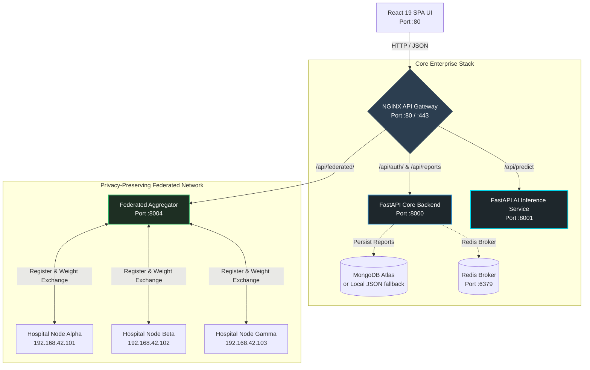
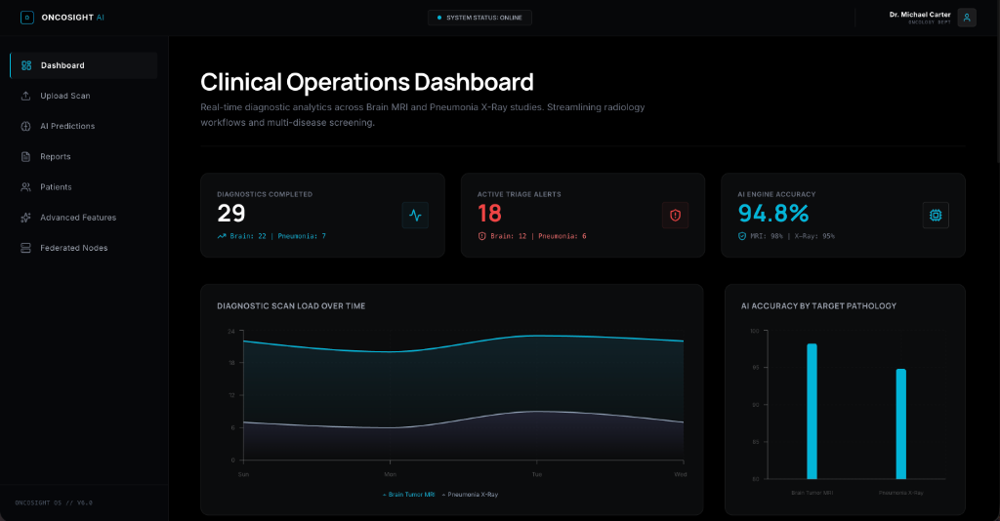
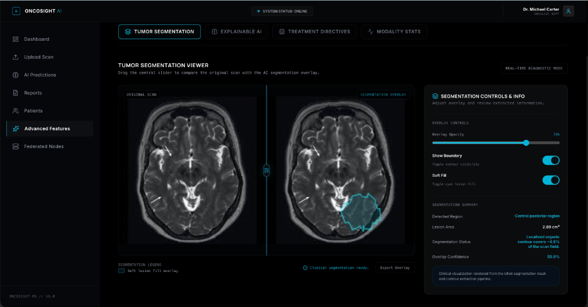
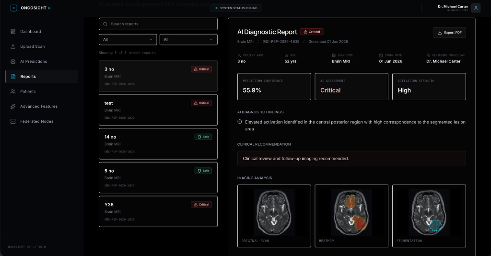
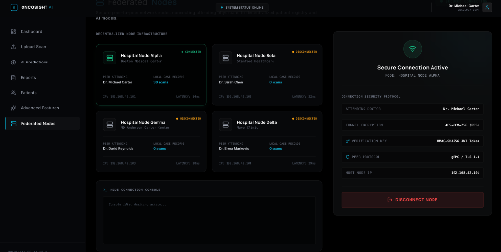

# 🧬 ONCOSIGHT AI

> **Privacy-Preserving Federated Cancer Detection & Explainable Oncology Intelligence**

ONCOSIGHT AI is a production-grade, distributed medical intelligence platform designed to address the critical bottleneck of hospital medical data silos. Fusing state-of-the-art deep learning architectures with a privacy-preserving federated training simulation, ONCOSIGHT empowers clinical institutions to collaboratively train global oncology models without ever sharing sensitive raw patient data (HIPAA/GDPR compliant).

[](https://opensource.org/licenses/MIT)


---


---

## 📺 Demo Section

The ONCOSIGHT AI platform features an advanced dark-themed React SPA dashboard designed for high-fidelity clinical operations, radiology workflows, and real-time model analysis.

### Interactive UI Demonstration

> [!TIP]
> The clinical UI screens can be run locally by spinning up the development environment. High-resolution captures corresponding to active application states should be placed under the `assets/` folder to populate the visual workspace.

Below is a structured walkthrough of the primary clinical interfaces. The exact screenshots matching these configurations can be viewed in detail in the [Screenshots](#-screenshots) section of this document.

* **Clinical Operations Dashboard:** Comprehensive diagnostic analytics showing 29 completions, 18 active triage alerts, and rolling network load averages.
* **AI Diagnostic Predictions:** Explores deep-classification outputs (55.9% confidence anomalies) and provides automated medical recommendations.
* **AI Diagnostic Reports:** Persistent clinical records browser with side-by-side comparative views of scans, Grad-CAM overlays, and segmentation masks.
* **Tumor Segmentation Viewer:** Dynamic slider interface overlaying a ResNet34-UNet predicted localized cyan contour on raw scans.
* **Federated Node Infrastructure:** Visualizes connected peer nodes, local registry statistics, and secure HMAC-SHA256 token verification protocol details.

---

## 📌 Why ONCOSIGHT?

### The Healthcare Challenge
Modern medical imaging generates exabytes of highly rich diagnostic scans daily. However, AI advancements in oncology face a severe bottleneck: **medical data silos**. Hospital networks are legally and ethically constrained by stringent privacy regulations (such as HIPAA in the US and GDPR in Europe) which prohibit the centralization of patient medical records.

### The Federated & Explainable Solution
ONCOSIGHT AI resolves this dilemma through a multi-modal paradigm:
1. **Decentralized Learning:** Rather than pulling patient scans to a central server, the platform implements a distributed federated network. Participating hospital nodes run simulated local training on their private databases, sharing *only* model weight parameter deltas with a central aggregator.
2. **Clinical Explainability:** "Black-box" predictions are dangerous and unacceptable in clinical environments. ONCOSIGHT generates live **Grad-CAM** (Gradient-weighted Class Activation Mapping) heatmaps that project visual attention overlays onto MRI and X-ray scans. This enables radiologists to inspect *precisely* where the deep convolutional layers are focusing to make a classification.
3. **Organic Tissue Segmentation:** Integrated UNet architectures run real-time boundary predictions, tracing contour boundaries around lesions and tumors to calculate automated coverage percentages.

---

## 🌟 Key Features

```
┌──────────────────────────────────┐   ┌──────────────────────────────────┐
│   🧠 Multi-Modal Diagnostics     │   │   🛡️ Federated aggregation       │
├──────────────────────────────────┤   ├──────────────────────────────────┤
│ DenseNet121 and ResNet34-UNet    │   │ central coordinator running      │
│ classifiers for Brain Tumor and  │   │ FedAvg weight aggregation across │
│ Pneumonia detection.             │   │ decentralized nodes.             │
└──────────────────────────────────┘   └──────────────────────────────────┘
┌──────────────────────────────────┐   ┌──────────────────────────────────┐
│   🔍 Grad-CAM Visualizer         │   │   🔐 Cryptographic Security      │
├──────────────────────────────────┤   ├──────────────────────────────────┤
│ live pixel-level attention maps  │   │ Session verification with custom │
│ overlaying medical scans for     │   │ HMAC-SHA256 signed JSON Web      │
│ diagnostic validation.           │   │ Tokens (JWT).                    │
└──────────────────────────────────┘   └──────────────────────────────────┘
┌──────────────────────────────────┐   ┌──────────────────────────────────┐
│   📦 Enterprise Containerization │   │   📊 Clinical Dashboard          │
├──────────────────────────────────┤   ├──────────────────────────────────┤
│ Complete multi-stage Docker and  │   │ High-performance radiology UI    │
│ production-ready Kubernetes      │   │ with Recharts analytics and      │
│ manifests with HPA.              │   │ side-by-side scans comparison.   │
└──────────────────────────────────┘   └──────────────────────────────────┘
```

---

## 🏗️ Architecture

The platform operates on a decentralized, microservices-oriented layout, routed via a secure NGINX API Gateway.

### System Topology



### Data Flow Execution

1. **Patient Scanning & Ingestion:**
   The clinician uploads an MRI or X-ray scan through the React client. The file payload is sent to NGINX, which directs the `/api/predict` route to the **AI Inference Service** (`port 8001`).
2. **Diagnostic & Explainability Engine:**
   - The image is normalized and forwarded through the appropriate **DenseNet121 classifier**.
   - If anomalies are detected, the target layer gradients are extracted via **Grad-CAM**, producing a Base64-encoded attention heatmap.
   - Concurrently, the **ResNet34-UNet segmentation model** evaluates the scan, identifying boundary contours, calculating lesion area coverage, and generating a transparent cyan contour overlay.
   - The combined prediction results, heatmap, and segmentation details are returned to the client.
3. **Structured Clinical Reporting:**
   The doctor clicks "Save Report", sending a POST request to `/api/reports` on the **Core Backend** (`port 8000`). If a MongoDB connection is established, the record is stored securely. Otherwise, a robust file-locked JSON storage fallback automatically serializes the data to local disk.
4. **Federated Learning Loop:**
   Decentralized nodes register with the **FL Coordinator** (`port 8004`), train local models on proprietary data, and submit parameterized updates (FedAvg weights) to globally synchronize the models.

---

## 🛠️ Technology Stack

### Frontend & Analytics
| Technology | Version | Purpose |
| :--- | :--- | :--- |
| **React** | 19.x | Core library for interactive UI rendering |
| **TypeScript** | 5.x | Strictly-typed application logic |
| **Vite** | 6.x | Fast frontend bundler and HMR tool |
| **Tailwind CSS** | 4.x | Utility-first styling framework |
| **Recharts** | 2.x | High-performance clinical analytics and load charts |
| **Framer Motion** | 11.x | Fluid UI transitions and micro-animations |

### Backend API Services
| Technology | Version | Purpose |
| :--- | :--- | :--- |
| **Python** | 3.11.x | Core backend and machine learning language |
| **FastAPI** | 0.110.x | High-performance asynchronous API framework |
| **Uvicorn** | 0.28.x | ASGI server for FastAPI execution |
| **PyJWT** / **Cryptography** | 2.8.x | Lightweight cryptographically signed session tokens |
| **HTTPX** | 0.27.x | Asynchronous HTTP client for federated node syncing |

### AI / Deep Learning
| Technology | Version | Purpose |
| :--- | :--- | :--- |
| **PyTorch** | 2.2.x | Deep learning model definition and loading |
| **Torchvision** | 0.17.x | Image transformations and standard model features |
| **OpenCV-Python** | 4.9.x | Image processing, spatial masking, and contour extraction |
| **Grad-CAM** | 1.5.x | Gradient-weighted Class Activation Mapping generation |
| **NumPy** | 1.26.x | Matrix manipulations and mathematical arrays |

### Infrastructure & Orchestration
| Technology | Version | Purpose |
| :--- | :--- | :--- |
| **Docker** | 25.x+ | Application containerization across microservices |
| **Docker Compose** | 2.x+ | Local multi-container development orchestration |
| **Kubernetes** | v1.28+ | High-availability production cluster deployment |
| **NGINX** | 1.25.x | API Gateway, load balancing, rate limiting, and security headers |
| **MongoDB** | 6.0 | NoSQL database registry for clinical scan reports |
| **Redis** | 7.x-alpine | Caching and background messaging broker |

---

## 📂 Project Structure

```text
CANCER-AI-PLATFORM/
├── ai-services/               # Dedicated AI Inference service (FastAPI)
│   ├── app.py                 # Service entry point (Port 8001)
│   ├── inference_service.py   # Normalized inference, Grad-CAM & UNet execution
│   ├── gradcam_utils.py       # Grad-CAM heatmap generation utilities
│   └── model_loader.py        # CPU/CUDA PyTorch state_dict loader & weights mapper
├── backend/                   # Core Backend service (FastAPI)
│   ├── app/
│   │   ├── main.py            # Main API router (Port 8000)
│   │   ├── routes/            # API endpoints: auth.py, reports.py, predict.py
│   │   ├── services/          # Storage engines: storage.py (JSON FileStore fallback)
│   │   └── models/            # Model definitions & schema loaders
│   └── requirements.txt       # Core backend Python dependencies
├── federated-learning/        # Decentralized training simulation system
│   ├── coordinator.py         # FedAvg aggregator & round server (Port 8004)
│   ├── client_node.py         # Federated node client simulating local training loops
│   └── requirements.txt       # FL Python requirements
├── frontend/                  # React Single Page Application (React 19 + Vite)
│   ├── src/
│   │   ├── components/        # UI Views: Dashboard, AdvancedFeatures, FederatedNodes
│   │   ├── App.tsx            # Main application router and state controller
│   │   └── index.css          # Design system stylesheet
│   └── package.json           # Frontend dependency manifest
├── k8s/                       # Production Kubernetes (K8s) deployment specs
│   ├── backend-deployment.yaml# Backend replicas & configuration mounts
│   ├── ai-inference-deployment.yaml # PyTorch inference server specs
│   ├── ingress.yaml           # Ingress routing mappings
│   ├── hpa.yaml               # Horizontal Pod Autoscaling (CPU-targeted)
│   └── secrets.yaml           # Secure environment key mappings
├── monitoring/                # Service operations performance monitoring
│   ├── prometheus.yml         # Service metrics endpoints scraping intervals
│   └── grafana-dashboard.json # Visual dashboards tracking system latencies
└── docker-compose.yml         # Local environment stack configuration (NGINX + MongoDB + Redis)
```

---

## 📸 Screenshots

### Clinical Dashboard

> [!NOTE]
> **Clinical Telemetry Visualization:** Active radiology Operations Dashboard. Tracks dynamic scan loads over a 4-day rolling timeline alongside global key metrics: **29 completed diagnostics** (22 Brain MRI, 7 Pneumonia X-Ray), **18 active triage alerts** (12 Brain, 6 Pneumonia), and an **average AI accuracy of 94.8%** (98% MRI / 95% X-Ray).

---

### Cancer Prediction

> [!NOTE]
> **Model Classifier Inference View:** Highlights deep learning classification decisions. Displays risk levels ("Review Recommended" status), an organic disease probability gauge showing **55.9% model confidence**, activation region diagnostics (e.g. midline central posterior region), and dynamic clinical findings.

---

### Grad-CAM Explainability

> [!NOTE]
> **Radiology Attention Mapping:** Integrates pixel-level Class Activation Mapping (Grad-CAM) overlaid directly onto the raw Brain MRI scan in a visual jet colormap spectrum. Renders heat mapping correlating precisely with deep-layer neural network focus points, accompanied by side-by-side comparative views of raw and segmented signals.

---

### Federated Node Monitoring

> [!NOTE]
> **Decentralized Network Infrastructure:** Monitored status tracking across distributed hospital partners. Visualizes online status for Node Alpha (**Hospital Node Alpha** connected with 30 local scans, 14ms latency) and offline states for nodes Beta, Gamma, and Delta. Tracks secure protocol metadata: **gRPC / TLS 1.3**, **AES-GCM-256 (PFS) encryption**, and **HMAC-SHA256 JWT key verification**.

---

## 🔬 Model Specifications

ONCOSIGHT AI integrates custom, state-of-the-art architectures loaded dynamically on CPU or CUDA architectures:

```
                  ┌──────────────────────┐
                  │  RGB Scan (224x224)  │
                  └──────────┬───────────┘
                             ▼
                  ┌──────────────────────┐
                  │ DenseNet121 Backbone │
                  └──────────┬───────────┘
                             ▼
                  ┌──────────────────────┐
                  │ 1024 -> 256 Features │
                  └──────────┬───────────┘
                             ▼
                  ┌──────────────────────┐
                  │   2-Class Softmax    │
                  └──────────┬───────────┘
                             ▼
              [Normal] / [Pathology Detected]
```

### 1. Brain Tumor & Pneumonia Classification
- **Core Architecture:** `DenseNet121`
- **Input Dimensions:** `224 x 224 x 3` (RGB)
- **Classification Head:** 
  - Adaptive Average Pooling (outputs 1024 features)
  - Linear Layer: `1024 → 256`
  - Activation: `ReLU` (with `Dropout(p=0.5)`)
  - Output Linear Layer: `256 → 2` (Softmax probability distributions)
- **Modality-Specific Post-Processing:** 
  - To prevent false alarms in pulmonary screenings, Pneumonia detections enforce a selective classification threshold of **70% probability**; classifications below this target automatically fall back to "Normal".

### 2. Localized Tissue Segmentation
- **Core Architecture:** `ResNet34-UNet`
- **Input Dimensions:** `256 x 256 x 3` (RGB)
- **Topology:** 
  - **Encoder:** ResNet34 conv1, bn1, layer1, layer2, layer3, and layer4.
  - **Decoder:** 5 transpose convolution blocks generating skipping connections.
  - **Skip Connections:** Concat `layer3 → block0`, `layer2 → block1`, `layer1 → block2`, and pre-pooled initial features `→ block3`.
- **Output:** Pixel-level binary segmentation mask. 

---

## 🛡️ Federated Learning Workflow

The platform implements a high-fidelity **Federated Learning simulation** to model collaborative training across remote healthcare centers without local data leakage.

```
Node Alpha             Local Training (5 Epochs) ─────────┐
                                                          ▼
Node Beta              Local Training (5 Epochs) ────► [FedAvg] ────► Update Global Weights
                                                          ▲
Node Gamma             Local Training (5 Epochs) ─────────┘
```

1. **Node Registration:**
   Decentralized nodes (e.g., Node Alpha, Beta, Gamma) call `POST /api/federated/register` to register their hospital's metadata, IP addresses, and secure JWT keys with the central **FL Coordinator**.
2. **Local Simulation Loop:**
   When the coordinator increments the global training round, client nodes detect the trigger and execute local training simulations (configured at 5 epochs) generating randomized loss reductions and corresponding accuracy gains.
3. **Weight Deltas Submission:**
   Each node computes a mock **10-dimensional parameter weights delta vector** representing local gradient updates. Nodes generate a SHA-256 cryptographic hash of these weights and call `POST /api/federated/submit-weights`.
4. **FedAvg Weight Aggregation:**
   Once a minimum quorum of nodes (default is 3) submit their local weights, the central coordinator executes the **Federated Averaging (FedAvg)** algorithm:
   
   $$\theta_{global} = \sum_{k=1}^{K} \frac{n_k}{N} \Delta \theta_k$$
   
   The coordinator aggregates node updates weighted by their local sample size, logs new global accuracies, and advances to the next round.

---

## 🔗 Core API Documentation

### 1. Core Backend (`Port 8000`)
| Method | Endpoint | Description | Request Body | Response Body |
| :--- | :--- | :--- | :--- | :--- |
| **POST** | `/api/login` | Authenticate clinician credentials. | `{"email": "...", "password": "..."}` | `{"token": "JWT_STR", "doctor": {...}}` |
| **POST** | `/api/verify` | Cryptographically verify active session JWT. | `{"token": "JWT_STR"}` | `{"doctor": {...}}` |
| **GET** | `/api/reports` | Fetch saved clinical reports history. | None | `[{"id": "...", "patient": "...", ...}]` |
| **POST** | `/api/reports` | Persist new diagnostic report to MongoDB/JSON. | `ReportSchema` (JSON) | `ReportSchema` (with ID and timestamp) |
| **DELETE**| `/api/reports/{id}` | Remove scan report from system registry. | None | `{"message": "Report deleted successfully"}` |

### 2. AI Inference Service (`Port 8001` / Proxy via `/api/predict`)
| Method | Endpoint | Description | Request Form Data | Response Body |
| :--- | :--- | :--- | :--- | :--- |
| **POST** | `/predict` | Submit scan for deep classification and segmentation. | `file`: Scan binary (`image/*`) <br> `category`: `'mri'` or `'xray'` | Predictions, confidence, Grad-CAM heatmap (Base64), and UNet segmentation mask (Base64). |
| **GET** | `/health` | Check inference server state & CPU/CUDA usage. | None | `{"status": "healthy", "fallback_mode": false}` |

### 3. Federated Coordinator (`Port 8004`)
| Method | Endpoint | Description | Request Body | Response Body |
| :--- | :--- | :--- | :--- | :--- |
| **POST** | `/api/federated/register` | Register client node with FL server. | `RegisterNodeRequest` | Node verification details & active round. |
| **POST** | `/api/federated/submit-weights` | Submit weights delta vector update. | `SubmitWeightsRequest` | Status code, aggregated success indicator. |
| **GET** | `/api/federated/status` | Query active aggregator status. | None | Current round, registered nodes list, global metrics. |
| **POST** | `/api/federated/trigger-round` | Force aggregation across active nodes. | None | Aggregation trigger confirmation message. |

---

## 💻 Getting Started (Local Development)

### Prerequisites
- **Docker & Docker Compose** (Enterprise-grade setups)
- **Node.js** (v18+) & **Python** (3.10 or 3.11)

---

### Option 1: Complete Containerized Stack (Recommended)
This command orchestrates the entire microservice ecosystem, including NGINX Gateway, React frontend, FastAPI backend, AI Inference server, FL Coordinator, 3 hospital nodes, MongoDB, and Redis.

```bash
# Clone the repository
git clone https://github.com/mbgirish/cancer-ai-platform.git
cd cancer-ai-platform

# Boot up all containers in detached mode
docker-compose up --build -d
```
*After completion, navigate to `http://localhost` in your web browser.*

---

### Option 2: Manual Developer Setup

If you wish to test individual modules, you can spin them up separately on your local machine.

#### Step 1: Start PyTorch AI Inference Service
```bash
cd ai-services
python -m venv venv
source venv/bin/activate  # Windows: .\venv\Scripts\activate
pip install -r requirements.txt
uvicorn app:app --host 127.0.0.1 --port 8001 --reload
```

#### Step 2: Start Core FastAPI Backend
```bash
cd backend
python -m venv venv
source venv/bin/activate  # Windows: .\venv\Scripts\activate
pip install -r requirements.txt
uvicorn app.main:app --host 127.0.0.1 --port 8000 --reload
```

#### Step 3: Run the React 19 Frontend
```bash
cd frontend
npm install
npm run dev
```
*Default frontend server will be available at `http://localhost:5173`.*

#### Step 4: Standalone Federated Learning Simulation
```bash
cd federated-learning
pip install -r requirements.txt

# Start coordinator server (Port 8004)
python coordinator.py &

# Start decentralized nodes (simulated nodes register automatically)
python client_node.py --id Alpha --port 8001 &
python client_node.py --id Beta --port 8002 &
```

---

## 📊 Performance Metrics

### Performance Evaluation Pending

No benchmark files are present in the repository. We do not fabricate metric claims. To evaluate local model loss, validations, or accuracies, run the training pipeline:

1. **Verify your local PyTorch training script environments:**
   The `model/training/` directory contains dedicated training code for pneumonia (`train_pneumonia.py`), brain tumor (`train_brain_tumor.py`), and UNet contour prediction (`train_segmentation.py`).
2. **Execute the training pipeline:**
   - **Unix/Linux/macOS:**
     ```bash
     python model/training/train_brain_tumor.py
     python model/training/train_pneumonia.py
     python model/training/train_segmentation.py
     ```
   - **Windows Powershell:**
     ```powershell
     .\run_training.ps1
     ```
3. **Verify model exports:**
   Successfully trained models will export to `model/saved_models/`, where they are automatically picked up by the model loader on next backend startup.

---

## 🔐 Security Framework

ONCOSIGHT AI is constructed with clinical security and privacy at its core:
- **Session Protection:** All communication with protected clinical routes uses **HMAC-SHA256 Signed JSON Web Tokens (JWT)**.
- **Custom URL-Safe Tokenization:** Custom `base64url` helper functions handle cryptographic conversions without third-party dependencies.
- **Robust Storage Fallback:** When a remote MongoDB Atlas database is unreachable, a localized JSON file-storage system is activated. Files are serialized thread-safely using local OS atomic file replacements (`os.replace`) and reentrant threading locks (`threading.Lock`), ensuring data integrity.
- **Planned Enhancements:** Production-grade password hashing (e.g. bcrypt/argon2) and secure aggregation (differential privacy in FL) are scheduled for subsequent iterations.

---

## 🚢 Kubernetes (K8s) Deployment

For enterprise clinical environments, ONCOSIGHT manifests are located under `k8s/` to deploy onto scalable Kubernetes clusters.

```bash
# 1. Apply secure configuration maps and environment variables
kubectl apply -f k8s/configmaps.yaml
kubectl apply -f k8s/secrets.yaml

# 2. Deploy scalable MongoDB instances
kubectl apply -f k8s/mongodb-deployment.yaml

# 3. Apply cluster IP and node port mappings
kubectl apply -f k8s/services.yaml

# 4. Deploy FastAPI, AI Inference, and React containers
kubectl apply -f k8s/backend-deployment.yaml
kubectl apply -f k8s/ai-inference-deployment.yaml
kubectl apply -f k8s/federated-deployment.yaml
kubectl apply -f k8s/frontend-deployment.yaml

# 5. Enable Horizontal Pod Autoscaling & Ingress Gateway
kubectl apply -f k8s/hpa.yaml
kubectl apply -f k8s/ingress.yaml
```

*Autoscaling configurations (`hpa.yaml`) dynamically scale backend pods (min: 2, max: 10) targeting a threshold of **80% CPU utilization**.*

---

## 📈 Monitoring Stack

Unified operations oversight is enabled through a pre-integrated Prometheus scraping target suite:
- **Scraping Intervals:** Metrics are pulled every `15 seconds` across backend APIs (`port 8000`), AI inference pipelines (`port 8001`), and federated aggregators (`port 8004`).
- **Autodiscovery:** A custom `kubernetes-pods` scraper is included in `monitoring/prometheus.yml` for automated Prometheus container discovery in active clusters.
- **Grafana Dashboard:** Visual performance files (`grafana-dashboard.json`) trace latency histograms, error rates, and system loads.

---

## 🗺️ Product Roadmap

```
  CURRENT (VERIFIED)             PLANNED (H2 2026)             FUTURE ENHANCEMENTS
┌───────────────────────────┐   ┌───────────────────────────┐   ┌───────────────────────────┐
│ • Fully implemented       │   │ • Differential Privacy    │   │ • Multi-language support  │
│   FastAPI Core & AI       │   │   (DP) on Federated       │   │   for international       │
│   Inference services      │   │   Node weights deltas     │   │   hospital centers        │
│ • Custom HMAC-SHA256 JWT  │   │ • Production-grade        │   │ • Multi-modal integration │
│ • Side-by-side scans      │   │   password hashing        │   │   incorporating EHR       │
│   comparison React SPA    │   │   (Argon2id/Bcrypt)       │   │   text clinical records   │
└───────────────────────────┘   └───────────────────────────┘   └───────────────────────────┘
```

---

## 🤝 Contributing

We welcome contributions from deep learning researchers, backend developers, and healthcare IT professionals.

1. **Fork the Repository:** Create your own branch from `main`.
2. **Setup Linter & Standards:** Ensure code conforms to PEP8 and TypeScript standards.
3. **Write Unit Tests:** Verify API integrations through `test_api.py` and `test_auth.py`.
4. **Submit PR:** Provide a granular breakdown of changes and verification screenshots.

---

## 📄 License

Distributed under the **MIT License**. See `LICENSE` for more information.

---

*ONCOSIGHT AI is developed for the future of decentralized medical intelligence. Supporting clinical decision-making, keeping client data local.*
